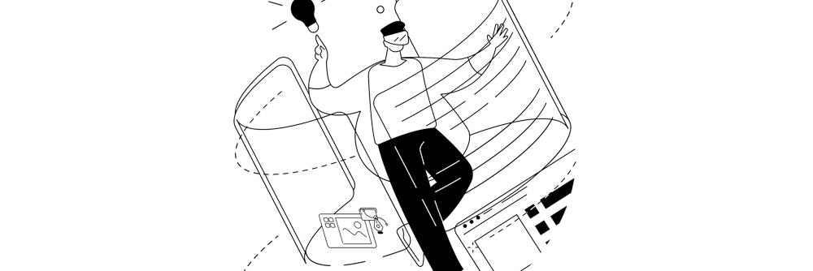
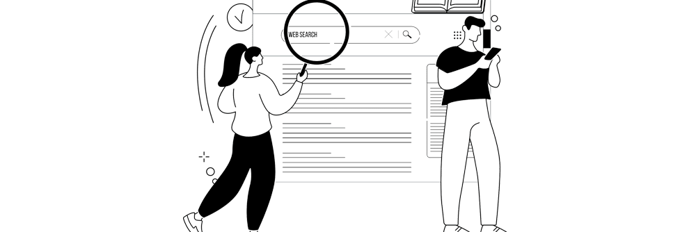
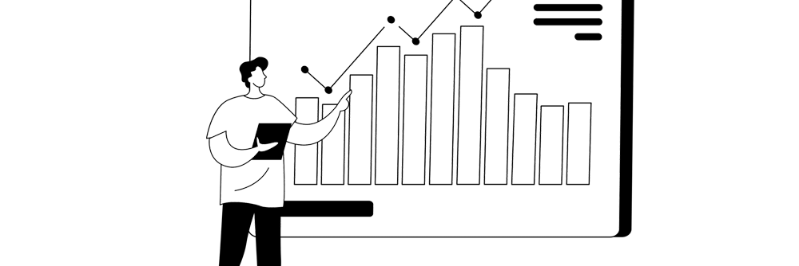

## About Viaprestige Web Agency

**[Viaprestige Web Agency](https://viaprestige-agency.com/agence-web-maroc/)** is an offshore agency based in Marrakesh, Morocco, blending technical expertise with creative vision. We craft tailored digital solutions across web and mobile development, SEO, inbound marketing, and seamlessly integrate leading CMS and frameworks such as WordPress, PrestaShop, and Drupal.

### What We Do

* **[Website Creation & Redesign](https://viaprestige-agency.com/creation-web/)**
  From concept to launch, Viaprestige ensures your site is responsive, visually appealing, user-friendly, and optimized for search engines. You retain full ownership with the flexibility to update your content independently. Maintenance services are also available.

  

* **[Visibility & Digital Positioning](https://viaprestige-agency.com/visibilite/)**
  If you already have a website, Viaprestige can recommend improvements via an in-depth SEO audit, competitive analysis, and a custom web marketing strategy—leveraging not just search engine tactics but also social media and blogging to amplify your online presence.

  

* **[White‑Label & Outsourcing Services](https://viaprestige-agency.com/agence-web-offshore-externalisation-web/)**
  Agencies and communication professionals wanting to expand into web technologies can collaborate with Viaprestige through white-label services, technical partnerships, or staff outsourcing—benefiting from competitive cost structures thanks to Morocco's favorable economy and the agency's efficient timezone alignment with Europe.

  

### Our Strengths

1. **Tailored Web Projects**
   Beyond standard CMS integration, we deliver bespoke digital solutions—from showcase sites to e-commerce platforms and vibrant online communities. Every project is crafted to align with your specific goals.

2. **Adaptability & Innovation**
   In a fast-evolving digital landscape, our team stays at the forefront of trends in responsive design, SEO, SEM, and social media, continually adapting strategies to meet rising user and Google expectations.

3. **Transparent, Practical Partnerships**
   We believe in honesty and shared knowledge. If your budget or timeline limits what's feasible, we offer realistic plans and help you build autonomy—whether through SEO guidance, strategy coaching, or clear communication.

4. **Competitive Pricing**
   Operating without VAT and benefiting from Morocco's cost advantages, Viaprestige delivers high-quality digital services at rates that offer excellent value and return on investment.

### Trusted by Many

Viaprestige has earned the trust of a diverse clientele, including notable names like Royal Mansour, Evolution2, Kensington, LRNCE, Supr‑cars, and more.  
[Request a quote](https://viaprestige-agency.com/demande-devis/)